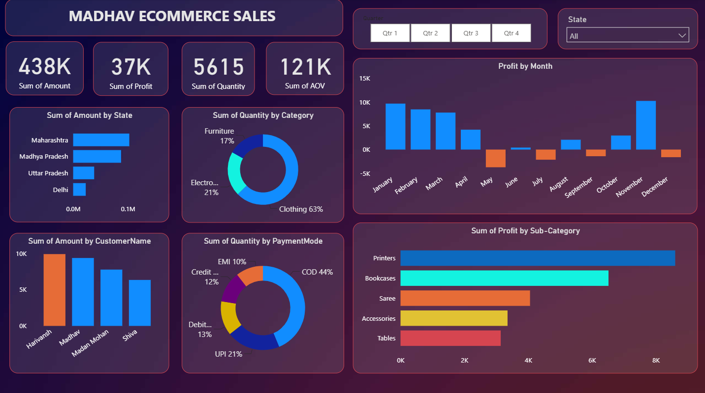
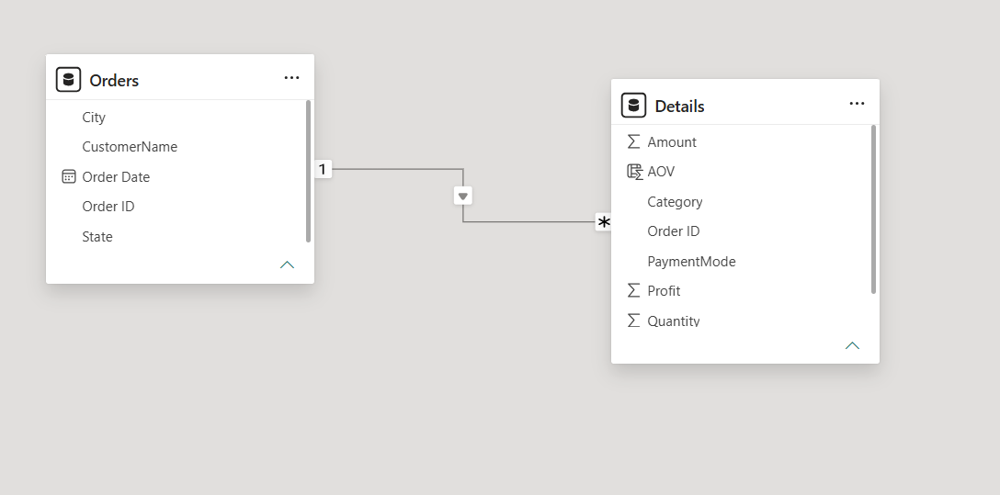

# Madhav Ecommerce Sales Dashboard using Power BI

## Project Overview

Interactive **Power BI dashboard** developed to analyze ecommerce sales performance and generate insights into sales, profit, customer behavior, payment methods, and product performance.

## Objectives

- Analyze sales and profit performance
- Track important business KPIs
- Analyze customer and product performance
- Compare sales across states, categories, and sub-categories
- Analyze payment methods and customer purchasing behavior
- Build an interactive dashboard for business decision-making

## Dataset

The project uses two datasets:

- **Orders.csv** – Order ID, Order Date, State, City, and Customer Name
- **Details.csv** – Category, Sub-Category, Quantity, Amount, Profit, Payment Mode, and Order ID

## Tools & Technologies

- Microsoft Power BI
- Power Query
- DAX
- Data Modeling
- Interactive Dashboard Design

## Data Preparation

Data was prepared using **Power Query** by:

- Importing Orders and Details datasets
- Checking missing values
- Removing duplicate records
- Verifying data types
- Renaming columns where required
- Loading the cleaned data into Power BI

## Data Modeling

A relationship was created between the **Orders** and **Details** tables to support filtering, aggregation, and interactive analysis.

## Key KPIs

- **Total Sales**
- **Total Profit**
- **Total Quantity**
- **Average Order Value (AOV)**

## Dashboard Analysis

The dashboard provides analysis of:

- Sales by State
- Quantity by Category
- Profit by Month
- Sales by Customer
- Quantity by Payment Mode
- Profit by Sub-Category

Interactive filters are provided for:

- Quarter
- State

## Key Business Insights

- **Maharashtra** generated the highest sales.
- **Clothing** contributed the largest share of quantity sold.
- **Cash on Delivery (COD)** was the most preferred payment method.
- **Printers** generated the highest profit among the sub-categories.
- Monthly profit remained consistently high during the selected quarter.
- Customer-wise analysis helps identify high-value customers.

## Dashboard Preview



## Data Model



## Project Highlights

- **Dashboard:** Microsoft Power BI
- **Data Preparation:** Power Query
- **Calculations:** DAX
- **Data Modeling:** Orders & Details relationship
- **KPIs:** Sales, Profit, Quantity, AOV
- **Analysis:** Sales, Customers, Products, Payment Methods & Profitability
- **Filters:** Quarter & State
- **Project Type:** Ecommerce Business Analytics

## Repository Structure

```text
madhav-ecommerce-sales-dashboard-powerbi/
├── Dataset/
│   ├── Orders.csv
│   └── Details.csv
├── Power BI File/
│   └── Madhav_Ecommerce_Sales_Dashboard.pbix
├── Report/
│   ├── madhav_ecommerce_sales_report.pdf
│   └── madhav_ecommerce_sales_report.docx
├── Screenshots/
│   ├── madhav_ecommerce_sales_dashboard.png
│   └── PowerBI_Data_Model.png
└── README.md
```

## How to Use

1. Download `Madhav_Ecommerce_Sales_Dashboard.pbix` from the `PowerBI` folder.
2. Open the file using **Power BI Desktop**.
3. If required, update the file paths for `Orders.csv` and `Details.csv`.
4. Refresh the data.
5. Use the slicers and visuals to explore the dashboard.

## Future Scope

- Add sales forecasting
- Add advanced customer segmentation
- Include year-over-year performance analysis
- Add more advanced DAX measures
- Publish the dashboard to Power BI Service

## Learning Outcomes

- Data Cleaning using Power Query
- Data Modeling and Relationships
- DAX Measure Creation
- KPI Development
- Interactive Dashboard Development
- Data Visualization
- Business Intelligence Reporting
- Business Insight Generation

## Author

**Ramkumar Sharma**  
B.Tech Information Technology | Aspiring Data Analyst
